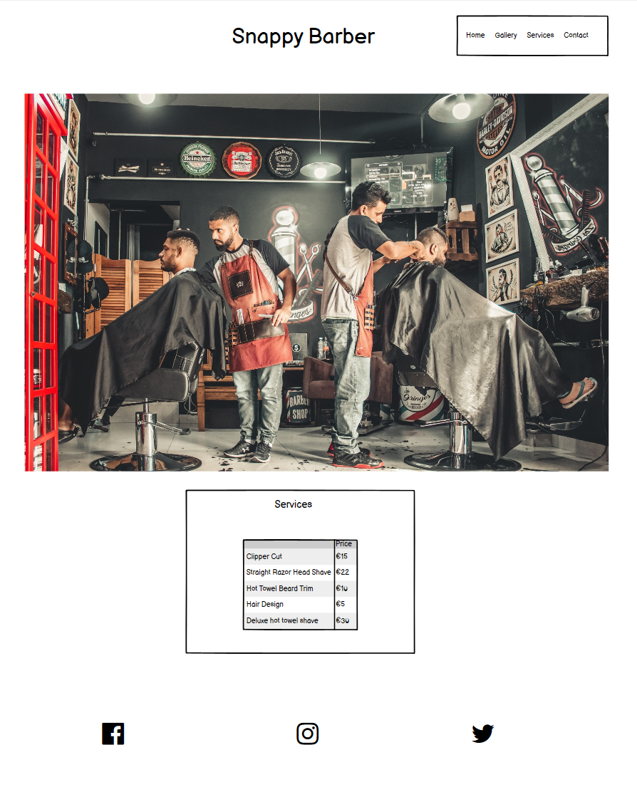
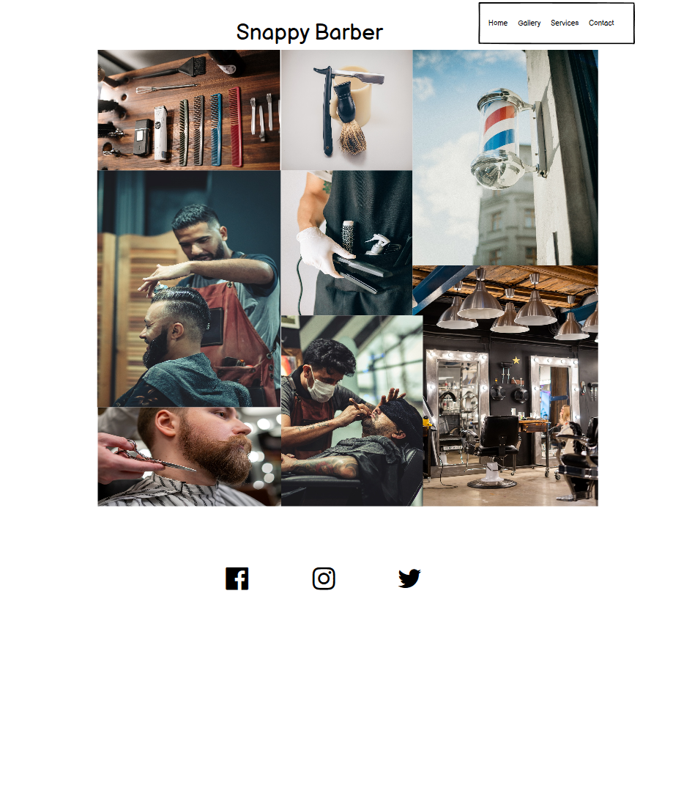
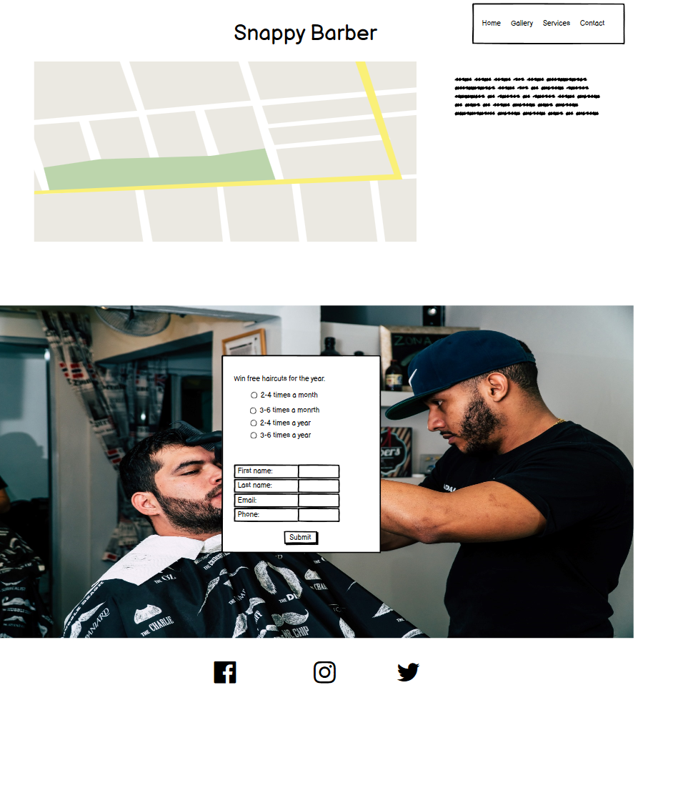

# Snappy Barber #
The barber website is a page designed to showcase the barbers work and services. It is aimed at men who want a haircut or beard attended to. 
Users of the website will be able to find all the information they need to know about the barber: About the barber, pricing, contact information. The site is targeted towards men and boys who want a hair cut and beard attended to. 

:desktop_computer: [Live Website] (https://eleanorbucke21.github.io/Snappy-Barber/)

:open_file_folder: [Github Repository] (https://github.com/eleanorbucke21/Snappy-Barber)

## UX 

### User stories

HOMEPAGE

- As a user I want to have a navigation bar so I can easily get to different pages.
- As a user I want to know what the site is about so I know what to expect from it.
- As a user I want to see the team behind the page with links to their github so that I can find out more about them.

GALLERY PAGE

- As a user I want to see pictures of the barbers previous work.
- As a user I want to see pictures of where the barbers work.

CONTACT PAGE

- As a user I would like to see opening and closing times.
- As a user I would like to see where the shop is situated on a map.
- As a user I would like to enter a competition for free hair cuts.

# Features #
## Navigation ##
* Featured at the top of the page, the navigation shows the Barber shop name in the left corner.
* The other navigation links are to the right: Home and Services that link to different sections on the same page. Gallery and Contact will link to other pages.
* The navigation is in a font that is modern and a color that contrasts with the background.
* The navigation clearly tells the user the name of the barber shop and website makes the different sections of information easy to find.
## The Header ##
* The header shows the name of the club using the color chosen: Slate Grey. 
* The header explains that is a barber shop.
* This section provides the user with clear information about who the site is for.
## The Services section ##
* The services give prices and what they offer. 
*	It gives a description of the service along with the price. 
## The contact section ##
* The contact section encourages users to get in touch and provides a phone number, email address and street where they can be found.
* It includes a google maps image of where they can be found.
## The competition section ##
* This section is a form that users must enter their name, email and phone number in order to submit.
* It will consist of radio button answers.

## Future Features ##

- In the future I wouls like to add a slide show to the gallery page.

# Typography and color scheme #
## Font ##
* I have chosen ubantu and heebo as a font as they give a modern look to the page.
 ## color scheme ##
* I have chosen black and slategrey as a color scheme to enhance the modern look that the font will give.

## Wireframes ##

## Technologies

### Languages used

- [HTML](https://en.wikipedia.org/wiki/HTML5) - Add content and formatting to web page.

- [CSS](https://en.wikipedia.org/wiki/CSS) - Add styling and colours to web page.

### Frameworks, Libraries and Programs Used

- [Gitpod](https://gitpod.io/) - web-based editor optimised for debugging, testing, syntax highlighting and extension support

- [Git](https://git-scm.com/) - used to allow for tracking of any changes in the code and for the version control.

- [Github](https://github.com/) - used to host the project files and host webpage onto the internet

- [Fontawesome](https://fontawesome.com/) - to insert icons in the website to make site more visually appealing and easy to navigate.

- [Google Fonts](https://fonts.google.com/) - used to import fonts in the style.css stylesheet.

## Testing
* [Chrome DevTools](https://developer.chrome.com/docs/devtools/)
    Chrome DevTools was used during the development process to test, debug, explore and modify HTML elements, and to test responsiveness in different screen sizes.
* [W3C CSS Validator] <a href="https://jigsaw.w3.org/css-validator/check/referer">
         was used to test for error codes in the CSS.
 *[https://validator.w3.org/] was used to test for error codes in the HTML.

 * [Lighthouse] 
    	- Index Page
            
 ## Test cases
 ### Index Page
 Input | Output 
    --- | --- 
 Clicked on Gallery in navigation bar. | It went to the Gallery page
 Clicked on Contact in navigation bar. | It went to the Contact page
 Clicked on Facebook icon in Footer.  | It opened Facebook in a new tab
 Clicked on Instagram icon in Footer.  | It opened Instagram in a new tab
 Clicked on Twitter icon in Footer.  | It opened Twitter in a new tab
 
 ### Gallery Page
 Input | Output 
    --- | --- 
 Clicked on Home in navigation bar. | It went to the index page.
 Clicked on Contact in navigation bar. | It went to the Contact page.
 Clicked on the logo in the header. | It went to the index page.
 Clicked on Facebook icon in Footer.  | It opened Facebook in a new tab.
 Clicked on Instagram icon in Footer.  | It opened Instagram in a new tab.
 Clicked on Twitter icon in Footer.  | It opened Twitter in a new tab.
 
 ### Contact Page
 Input | Output 
    --- | --- 
 Clicked on Home in navigation bar. | It went to the index page.
 Clicked on the logo in the header. | It went to the index page.
 Clicked on Contact in navigation bar. | It went to the Contact page.
 Clicked on Gallery in navigation bar. | It went to the Gallery page.
 Clicked on Facebook icon in Footer.  | It opened Facebook in a new tab.
 Clicked on Instagram icon in Footer.  | It opened Instagram in a new tab.
 Clicked on Twitter icon in Footer.  | It opened Twitter in a new tab.
 Clicked on Enter Competition button with no entries | It said please out field in name.
 Clicked on Enter Competition button with name filled in | It said please out field in email.
 Clicked on Enter Competition button with name filled in |  It said please out field in name.
 
 ###Competition Page
 Clicked on Home in navigation bar. | It went to the index page.
 Clicked on Gallery in navigation bar. | It went to the Gallery page.
 
 Clicked on the logo in the header. | It went to the index page.
 Clicked on Facebook icon in Footer.  | It opened Facebook in a new tab.
 Clicked on Instagram icon in Footer.  | It opened Instagram in a new tab.
 Clicked on Twitter icon in Footer.  | It opened Twitter in a new tab.
 
* Responsiveness
 [Am I Responsive?](http://ami.responsivedesign.is/#) was used to check responsiveness of the site pages across different devices.
 
 The site has been tested on various sizes such as those listed below.
 
 Mobile:
 375x667 / 360x740 / 412x915 / 414x896
 
 Tablet:
 768x1024 / 820x1180 / 912x1368 
 
 Monitor:
 1280x1024 / 1600x900 / 2560x1440 / 3440x1440
 
 ### Manual Testing

* Browser Compatibility

     Browser | Outcome | Pass/Fail 
     --- | --- | ---
     Google Chrome | No appearance, responsiveness nor functionality issues.| Pass
     Safari | No appearance, responsiveness nor functionality issues. | Pass
     Microsoft Edge | No appearance, responsiveness nor functionality issues. | Pass
     Firefox | No appearance, responsiveness nor functionality issues. | Pass
     
 * Device compatibility

     Device | Outcome | Pass/Fail
    --- | --- | ---
    Laptop | No appearance, responsiveness nor functionality issues. | Pass
    ipad mini | No appearance, responsiveness nor functionality issues. | Pass
    Lenovo M1 Tab | No appearance, responsiveness nor functionality issues. | Pass
    Samsung s20 | No appearance, responsiveness nor functionality issues. | Pass
    iphone 12 pro | No appearance, responsiveness nor functionality issues. | Pass

## Deployment

This website was published using GitHub Pages.

- Navigate to [GitHub](https://github.com/) and log in.

- Navigate to your repositories and find the project you want to deploy

- Under the name of your chosen Repository you will see a ribbon of selections, click on 'Settings' located on the right hand side.

- Scroll down till you see 'Pages' heading on the left hand side

- Under the 'Source' click on the dropdown and select 'master' or 'main' branch and click save

- The page will reload and you'll see the link of your published page displayed under 'GitHub' pages.

- It takes a few minutes for the site to be published, wait until the background of your link changes to a green color before trying to open it.

- Congratulations you have deployed your project!

## Credits

### Media

-[Barber hair tools](https://res.cloudinary.com/dwfsh0lgy/image/upload/c_scale,h_1600,w_2500/v1658338281/Snappy/gallery/pexels_hair_tools_ikh4v6.webp)
-[Man getting straight razor shaved](https://res.cloudinary.com/dwfsh0lgy/image/upload/c_scale,h_2500,w_1600/v1658338281/Snappy/gallery/pexels_man_straight_razor_vj2ffo.webp)
-[Man getting beard trimmed](https://res.cloudinary.com/dwfsh0lgy/image/upload/c_scale,h_1600,w_2500/v1658338280/Snappy/gallery/pexels_beard_trim_jbfody.webp)
-[Barber cleaning mans collar](https://res.cloudinary.com/dwfsh0lgy/image/upload/c_scale,h_1600,w_2500/v1658339412/Snappy/gallery/pexels_barber_cleaning_mans_collar_oyvoaz.webp)
-[straight razor and shaving cream brush](https://res.cloudinary.com/dwfsh0lgy/image/upload/c_scale,h_1600,w_2500/v1658338281/Snappy/gallery/pexels_shaving_brish_and_straight_razor_ocgrx3.webp)
-[Man getting hair trimmed](https://res.cloudinary.com/dwfsh0lgy/image/upload/c_scale,h_2500,w_1600/v1658338280/Snappy/gallery/pexels_hair_spray_ex6bw3.webp)
-[Image of a barber pole outside the shop](https://res.cloudinary.com/dwfsh0lgy/image/upload/c_scale,h_2500,w_1600/v1658338902/Snappy/gallery/Pexels_Barber_Pole_wjjy0u.webp)
-[Customer getting hair trimmed](https://res.cloudinary.com/dwfsh0lgy/image/upload/c_scale,h_1600,w_2500/v1658338280/Snappy/gallery/pexels_fringe_trim_btjejb.webp)
-[Man getting beard shaved by straight razor](https://res.cloudinary.com/dwfsh0lgy/image/upload/c_scale,h_1600,w_2500/v1658339026/Snappy/gallery/ezgif.com-gif-maker_tueq6h.webp)

### Content
- [Poppins - Google font](https://fonts.google.com/specimen/Roboto)

- [Roborto - Google Fonts](https://fonts.google.com/specimen/Poppins?query=poppins)
