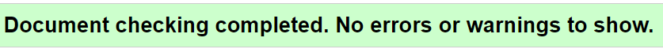
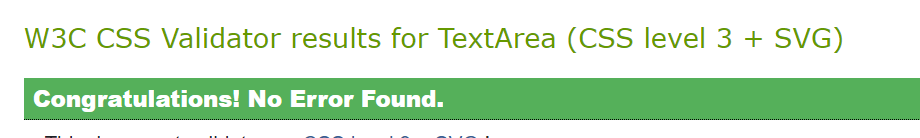

## TABLE OF CONTENTS

* [Automated Testing and Validation](#automated-testing-and-validation)
    * [HTML Validation](#html-validation)
    * [CSS Validation](#css-validation)
    * [Lighthouse Report](#lighthouse-report)
    * [Responsiveness](#responsiveness) 
* [Manual Testing](#manual-testing)
    * [Test Cases](#test-cases)
    * [Full Testing](#full-testing)

---

## <strong>Testing</strong>
- [W3C Markup Validation Serice](https://validator.w3.org/) was used to test for error codes in the HTML.
- [W3C CSS Validator](https://jigsaw.w3.org/css-validator/)  was used to test for error codes in the CSS.
- [Chrome DevTools](https://developer.chrome.com/docs/devtools/)
    was used during the development process to test, debug, explore and modify HTML elements, and to test responsiveness in different screen sizes.
- [Lighthouse](https://developer.chrome.com/docs/lighthouse/overview/) was used for improving the quality of web page. It has audits for performance, accessibility, progressive web apps, SEO, and more.

## Automated Testing and Validation
### HTML Validation
We used [W3C Markup Validation Service](https://validator.w3.org/) to validate all the HTML files by direct input:
|Page |Pass/Fail |  Results |
| ------------- | ------------- |------------- |
| Index | :heavy_check_mark: ||
| Gallery | :heavy_check_mark: ||
| Contact | :heavy_check_mark: ||
| Confirmation | :heavy_check_mark: ||

 

### CSS Validation
We used [W3C CSS Validation Service](https://jigsaw.w3.org/css-validator/) to validate all CSS files by direct input.

|Page | Pass/Fail  | Results |
| ------------- | ------------- |------------- |
| assets/css/stylesheet.css | :heavy_check_mark: ||
 

 ## Lighthouse
| Page | Results | 
|--- | --- |
|Index Page ||
| Gallery Page |  |
| Contact Page ||
|Competition Page | |

      

## Responsiveness
[Am I Responsive?](http://ami.responsivedesign.is/#) was used to check responsiveness of the site pages across different devices.
 
 The site has been tested on various sizes such as those listed below.
 
 <strong>Mobile:</strong>
 375x667 / 360x740 / 412x915 / 414x896
 
 <strong>Tablet:</strong>
 768x1024 / 820x1180 / 912x1368 
 
<strong>Monitor:</strong>
 1280x1024 / 1600x900 / 2560x1440 / 3440x1440

  

## Manual Testing
Browser Compatibility:

Browser | Outcome | Pass/Fail 
 --- | --- | ---
Google Chrome | No appearance, responsiveness nor functionality issues.| :heavy_check_mark:
Safari | No appearance, responsiveness nor functionality issues. | :heavy_check_mark:
Microsoft Edge | No appearance, responsiveness nor functionality issues. | :heavy_check_mark:
Firefox | No appearance, responsiveness nor functionality issues. | :heavy_check_mark:

 

Device compatibility:

Device | Outcome | Pass/Fail
--- | --- | ---
Laptop | No appearance, responsiveness nor functionality issues. | :heavy_check_mark:
ipad mini | No appearance, responsiveness nor functionality issues. | :heavy_check_mark:
Lenovo M1 Tab | No appearance, responsiveness nor functionality issues. | :heavy_check_mark:
Samsung s20 | No appearance, responsiveness nor functionality issues. | :heavy_check_mark:
iphone 12 pro | No appearance, responsiveness nor functionality issues. | :heavy_check_mark:
            
 ## Test cases
 ### Index Page
 
| Input | Output | Pass/Fail |
|--- | --- | --- |
|  Clicked on Gallery in navigation bar. | It went to the Gallery page | :heavy_check_mark:
| Clicked on Contact in navigation bar. | It went to the Contact page | :heavy_check_mark:
| Clicked on Facebook icon in Footer.  | It opened Facebook in a new tab | :heavy_check_mark:
| Clicked on Instagram icon in Footer.  | It opened Instagram in a new tab | :heavy_check_mark:
| Clicked on Twitter icon in Footer.  | It opened Twitter in a new tab | :heavy_check_mark:
 
 ### Gallery Page
 
| Input | Output | Pass/Fail |
|--- | --- | --- |
| Clicked on Home in navigation bar. | It went to the index page. | :heavy_check_mark:
| Clicked on Contact in navigation bar. | It went to the Contact page. | :heavy_check_mark:
| Clicked on the logo in the header. | It went to the index page. | :heavy_check_mark:
| Clicked on Facebook icon in Footer.  | It opened Facebook in a new tab. | :heavy_check_mark:
| Clicked on Instagram icon in Footer.  | It opened Instagram in a new tab. | :heavy_check_mark:
| Clicked on Twitter icon in Footer.  | It opened Twitter in a new tab. | :heavy_check_mark:
 
 ### Contact Page
 
| Input | Output | Pass/Fail |
|--- | --- | --- |
| Clicked on Home in navigation bar. | It went to the index page. | :heavy_check_mark:
| Clicked on the logo in the header. | It went to the index page. | :heavy_check_mark:
| Clicked on Contact in navigation bar. | It went to the Contact page. | :heavy_check_mark:
| Clicked on Gallery in navigation bar. | It went to the Gallery page. | :heavy_check_mark:
| Clicked on Facebook icon in Footer.  | It opened Facebook in a new tab. | :heavy_check_mark:
| Clicked on Instagram icon in Footer.  | It opened Instagram in a new tab. | :heavy_check_mark:
| Clicked on Twitter icon in Footer.  | It opened Twitter in a new tab. | :heavy_check_mark:
| Clicked on Enter Competition button with no entries | It said please out field in name. | :heavy_check_mark:
| Clicked on Enter Competition button with name filled in | It said please out field in email. | :heavy_check_mark:
| Clicked on Enter Competition button with email filled in |  It said please out field in name. | :heavy_check_mark:
| Clicked on Enter Competition with form filled out | It went to the Confirmation page. | :heavy_check_mark:
 
 ### Competition Page
 
| Input | Output | Pass/Fail |
|--- | --- | --- |
| Clicked on Home in navigation bar. | It went to the index page. | :heavy_check_mark:
| Clicked on Gallery in navigation bar. | It went to the Gallery page. | :heavy_check_mark:
| Clicked on the logo in the header. | It went to the index page. | Pass
| Clicked on Facebook icon in Footer.  | It opened Facebook in a new tab. | :heavy_check_mark:
| Clicked on Instagram icon in Footer.  | It opened Instagram in a new tab. | :heavy_check_mark:
| Clicked on Twitter icon in Footer.  | It opened Twitter in a new tab. | :heavy_check_mark:
 
